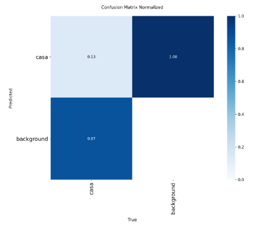
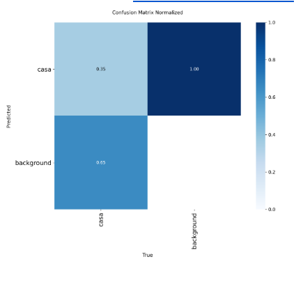
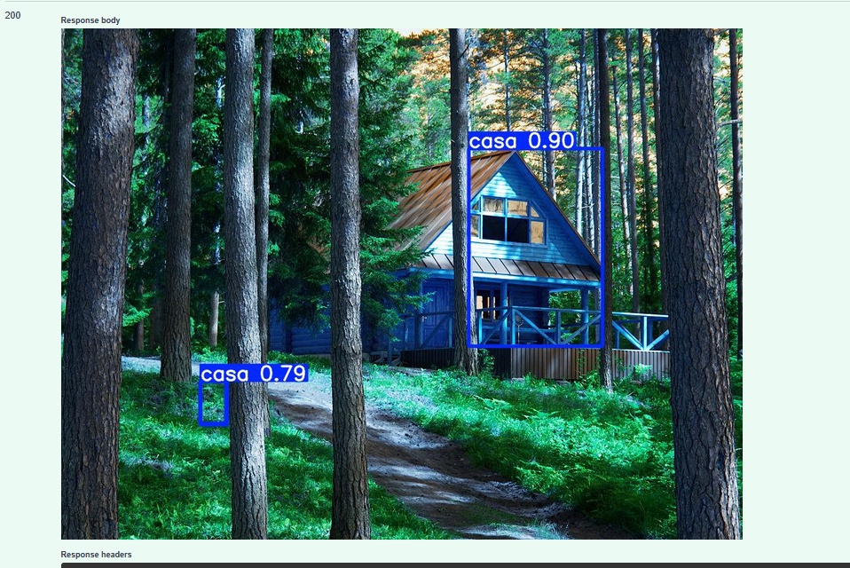
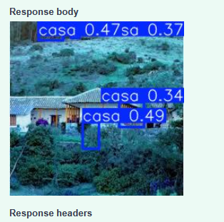
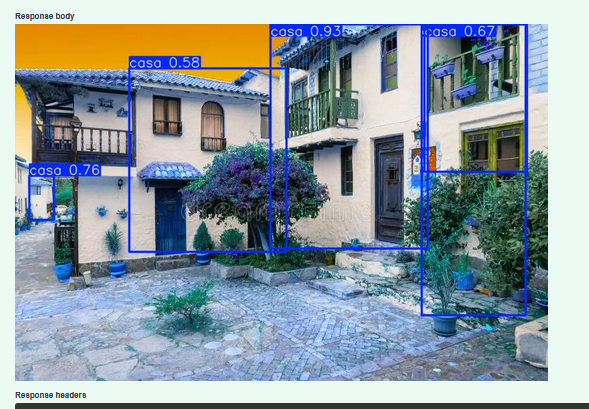

# Taller de Detección de Casas con YOLO26

## 1. Descripción del dataset y origen de imágenes

El conjunto de datos está compuesto originalmente por 58 fotografías de fachadas de casas tomadas en diversas ciudades de Colombia. Las imágenes fueron recopiladas a partir de fuentes públicas (prensa digital de Medellín y bogotá, imágenes sin licenciamiento rastreadas por Google) y contribuciones propias en pueblos colombianos. Fueron etiquetadas manualmente para marcar las áreas donde se observa una fachada en la plataforma Roboflow.

El formato utilizado es YOLO (imagen + archivo `.txt` con coordenadas normalizadas de las cajas). Además, el dataset se dividió en 70% `train` (41), 20% `valid` (12) y 10% `test` (10).

Finalmente, aumentamos el conjunto de entrenamiento aplicando ruido y volteando las imágenes horizontalmente, con lo cual este quedó constituido por 123 imágenes.

## 2. Instrucciones para reproducir el entrenamiento y la inferencia

## Estructura del Proyecto

```text
taller-yolo-casas/
├── src/
│   ├── download_dataset.py
│   ├── train_yolo.py
│   ├── export_model.py
│   ├── inferencia.py
│   └── utils.py
├── models/
├── ejemplos/
├── requirements.txt
├── .env
├── data.yaml
└── README.md
```

## 🚀 Comandos Rápidos

Una vez configurado el ambiente y el `.env`, estos son los comandos principales:

| Paso | Comando | Descripción |
| :--- | :--- | :--- |
| **1. Descargar** | `python src/download_dataset.py` | Baja el dataset de Roboflow a `/dataset` |
| **2. Entrenar** | `python src/train_yolo.py` | Inicia entrenamiento local (YOLO26 Medium) *si tienes el modelo entrenado, solo agrégalo como se indica en el apartado 4. |
| **3. Exportar** | `python src/export_model.py` | Convierte el mejor `best.pt` a `house_detector_prod.onnx` |
| **4. Inferir** | `python src/inferencia.py` | Prueba el modelo con imágenes de validación |
| **5. Metricas** | `python src/val_metrics.py` | Reporta mAP@0.5, Precision y Recall |
| **6. API** | `python src/main_api.py` | Inicia el servidor de despliegue (FastAPI) |

---

## Guía de Uso Detallada

### 1. Configuración Inicial
Instala las dependencias en tu ambiente virtual:
```bash
python3 -m venv venv
source venv/bin/activate
pip install -r requirements.txt
```

### 2. Configurar Credenciales
Crea un archivo `.env` en la raíz con las credenciales de Roboflow:
```text
ROBOFLOW_API_KEY=tu_api_key_aqui
ROBOFLOW_WORKSPACE=tu_workspace
ROBOFLOW_PROJECT=tu_proyecto
ROBOFLOW_VERSION=4
```

### 3. Descarga de Datos
Para obtener las imágenes etiquetadas:
```bash
python src/download_dataset.py
```

### 4. Entrenamiento del Modelo
Puedes entrenar localmente o en la nube:
*   **Local:** `python src/train_yolo.py`. Los resultados se guardan en `runs/detect/train_casasX`.
*   **Google Colab:** Si entrenas en Colab, descarga el `best.pt` y colócalo en `models/` renombrado como `best_colab.pt`.

### 5. Exportación a Producción (Optativo pero Recomendado)
Para optimizar el modelo para CPUs o servidores:
```bash
python src/export_model.py
```
*El script detectará automáticamente el entrenamiento más reciente o el archivo de Colab.*

### 6. Ejecución de Inferencia
Para validar los resultados visualmente:
```bash
python src/inferencia.py
```

### 7. Reporte de Métricas
Para obtener un reporte detallado del rendimiento en el conjunto de validación:
```bash
python src/val_metrics.py
```
Este script mostrará:
*   **Precision**: Capacidad del modelo para no etiquetar como positiva una muestra negativa.
*   **Recall**: Capacidad del modelo para encontrar todas las muestras positivas.
*   **mAP@0.5**: Error promedio de precisión a un umbral de IoU de 0.5.

### 8. Despliegue (API con FastAPI)
Crea un servidor web para procesar imágenes a través de una API. El endpoint devolverá la imagen con las cajas y scores:
```bash
python src/main_api.py
```
*   **Endpoint:** `POST /predict`
*   **Documentación Interactiva:** Una vez encendida, entra a `http://localhost:8000/docs` para probarla subiendo una imagen desde el navegador.


## 3. Resultados (métricas) y ejemplos de detección

Entrenamos el modelo de distintas maneras. Inicialmente solo dejamos una imagen para validación y esto provocó que el modelo nos arrojara erróneamente métricas de validación excepcionalmente altas a pesar de que confundía las casas con el fondo el 87% de las veces y las detectaba correctamente solo el 13%.

Decidimos entonces dividir mejor el conjunto de datos, aumentar el conjunto de prueba x3 y reentrenar aumentando las épocas (pasamos de 25 a 100). 

Los resultados mejoraron, aunque el modelo sigue teniendo muchas limitaciones. Según la nueva matriz de confusión normalizada, ahora detectamos el 35% de las casas correctamente (+22%) y pasamos de 85% de falsos negativos al 65%. 

```markdown


```

Las métricas generales, con el segundo modelo, quedaron así:

```markdown
| Métrica    | Valor  |
|------------|--------|
| Precision  | 0.49   |
| Recall     | 0.38   |
| mAP@0.5    | 0.35   |
```

Algunos ejemplos de detección evidencian que hubo avances pero aún encuentra casas fantasma donde el fondo o el contexto son ruidosos, como en la naturaleza:

```markdown



```

---

## 4. Limitaciones y pasos futuros recomendados

- El modelo actual sólo reconoce una clase genérica de "casa"; sin embargo el etiquetado tan generalista obliga a combinar formas que pueden ser muy distintas y por eso sería útil ampliar a subtipos (finca, apartamento, casa urbana, casa rural, etc.)
- Las imágenes están sesgadas hacia ciertas regiones geográficas, lo que podría afectar la generalización. Sería útil no solo tener más imágenes sino imágenes más diversas también, sobretodo aquellas donde el contexto y el fondo son ruidosos o donde las casas están juntas.
- No se han probado técnicas de aumento avanzadas ni modelos más grandes por falta de recursos.

---

> **Nota sobre Git:** Los archivos `.env`, la carpeta `dataset/`, la carpeta `runs/` y los modelos `.pt` están configurados en el `.gitignore` para no ser subidos al repositorio por seguridad y eficiencia.

👥 Autores

    Sara Castillejo - scastillejoditta
    Stefany Mojica - stefymojica
    Alexander Pineda - alexpineda
